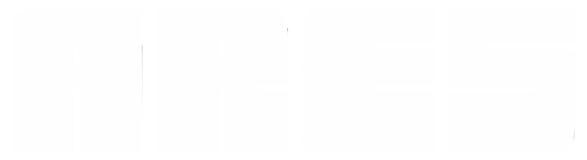

# Animaciones ARES — Especificaciones para Claude

Pagina: `comunidad.html` (`C:\Users\solde\OneDrive\Desktop\ARES\GPS\landing\contenido\comunidad.html`)

---

## 1. SECCION 2 — #funciones (grid de 6 tarjetas, fondo blanco)

**XPath:** `/html/body/section[2]`

**Que hay ahora:** 6 tarjetas `.fn-card` en un grid `.fn-grid` de 3 columnas, fondo blanco `var(--white)`. Las tarjetas muestran las funciones sociales de ARES (acceso compartido, ranking, red de confianza, grupos, recompensas, rankings nacionales).

### 1A. SVGs FLOTANTES

**Que queremos añadir:**
SVGs flotantes que pasan por detras de las tarjetas y el texto. No por encima — entre el fondo blanco y las tarjetas.

**Ideas de SVGs flotantes:**
- Huesos de perro estilizados (silueta simple)
- Huellas de perro (paw prints)
- Siluetas pequeñas de perros corriendo
- Corazones pequeños
- Pequeñas estrellas o brillos

**Comportamiento:**
- 8-12 elementos SVG pequeños (~30-50px)
- Se mueven lentamente de forma aleatoria/organica por toda la seccion
- Movimiento tipo "flotar" — suben, bajan, se desplazan lateralmente con easing suave
- Algunos rotan ligeramente mientras flotan
- Opacidad baja (~0.15-0.25) en azul cielo `#86BBD8`
- Animacion continua, estilo parallax organico
- NO usar canvas — usar elementos SVG inline o `` con CSS animations/JS
- Deben estar detras del contenido (z-index bajo, pointer-events: none)

**Implementacion sugerida:**
```html
<div class="fn-float-bg" aria-hidden="true">
  <!-- SVGs aqui -->
</div>
```
```css
.fn-float-bg{position:absolute;inset:0;z-index:0;pointer-events:none;overflow:hidden}
#funciones{position:relative}
```

### 1B. GLOW NARANJA — SOLO LAS 6 TARJETAS DE ARRIBA

**IMPORTANTE:** El glow SOLO en las 6 `.fn-card` de #funciones. NO en `.caso-card`.

**Efecto deseado:** Al pasar el cursor sobre una tarjeta, sale un resplandor naranja `#F26419` por detras, como una luz encendida. Debe combinarse con la animacion `translateY(-5px)` al hacer hover.

#### Historial de intentos (lo que se ha probado y NO ha funcionado bien):

1. **box-shadow comun**
   - Problema: `clip-path: polygon(...)` recorta el box-shadow. No se ve nada en los bordes a 45°.
   - CSS probado: `box-shadow:0 0 35px rgba(242,100,25,0.35), 0 0 70px rgba(242,100,25,0.15)`
   - Resultado: invisible.

2. **box-shadow con spread (anillo solido)**
   - CSS probado: `box-shadow:0 0 0 3px rgba(242,100,25,0.35), 0 0 40px 10px rgba(242,100,25,0.22)`
   - Resultado: el anillo sale pero clip-path lo recorta en las esquinas. El glow grande no se ve.

3. **filter: drop-shadow()**
   - Ventaja: drop-shadow sigue la silueta del clip-path (incluye esquinas a 45°).
   - CSS actual en el archivo: `filter:drop-shadow(0 0 8px rgba(242,100,25,0.9)) drop-shadow(0 0 30px rgba(242,100,25,0.6)) drop-shadow(0 10px 35px rgba(242,100,25,0.4))`
   - Resultado: en teoria deberia verse. Tiene 3 capas de sombra naranja con opacidades 0.9, 0.6, 0.4. Pero el usuario dice que sigue sin apreciarse bien.

4. **Posible solucion: pseudo-elemento ::after con gradiente radial**
   ```css
   .fn-card{position:relative;overflow:visible}
   .fn-card::after{content:'';position:absolute;inset:-15px;z-index:-1;
     background:radial-gradient(ellipse at center, rgba(242,100,25,0.5) 0%, transparent 70%);
     opacity:0;transition:opacity 0.3s;pointer-events:none}
   .fn-card:hover::after{opacity:1}
   ```
   - Riesgo: si clip-path recorta ::after, esto tampoco funcionara.

5. **Solucion definitiva si nada anterior funciona: wrapper div**
   - Envolver cada `.fn-card` en `<div class="fn-card-wrap">`
   - El wrapper NO tiene clip-path, solo la tarjeta interior si
   - El glow (box-shadow o ::after) va en el wrapper
   - Ejemplo:
   ```html
   <div class="fn-card-wrap"><div class="fn-card">...</div></div>
   ```
   ```css
   .fn-card-wrap{transition:transform 0.3s}
   .fn-card-wrap:hover{transform:translateY(-5px)}
   .fn-card-wrap:hover .fn-card{box-shadow:0 0 40px rgba(242,100,25,0.5),0 0 80px rgba(242,100,25,0.3)}
   ```
   - ESTA ES LA SOLUCION RECOMENDADA si nada mas funciona. El wrapper sin clip-path permite que el box-shadow se renderice completo.

**Estado actual del CSS (en el archivo):**
```css
.fn-card{position:relative;z-index:1;background:#fff;border:1px solid rgba(47,72,88,0.1);padding:2rem 1.6rem;clip-path:polygon(14px 0,100% 0,100% calc(100% - 14px),calc(100% - 14px) 100%,0 100%,0 14px);box-shadow:0 2px 12px rgba(47,72,88,0.05);transition:transform 0.3s,filter 0.3s}
.fn-card:hover{transform:translateY(-5px);filter:drop-shadow(0 0 8px rgba(242,100,25,0.9)) drop-shadow(0 0 30px rgba(242,100,25,0.6)) drop-shadow(0 10px 35px rgba(242,100,25,0.4))}
```

---

## 2. SECCION 4 — #casos (3 tarjetas de casos de uso, fondo blanco)

**XPath:** `/html/body/section[4]`

**Que hay ahora:**
- 3 tarjetas `.caso-card` en un grid `.casos-grid` de 3 columnas
- Debajo un placeholder de video (`.casos-video-wrap > .casos-video` con gradiente oscuro)
- El video esta posicionado para meterse por detras de las tarjetas (`z-index:0`) y sobresalir por los lados

**CSS actual del placeholder:**
```css
style="position:relative;z-index:0;margin-top:-6rem;margin-left:-3rem;margin-right:-3rem"
```
- `margin-top:-6rem`: se mete ~mitad de altura por detras de las tarjetas
- `margin-left/right:-3rem`: sobresale 3rem por cada lado

**Que hay que hacer:**
1. Sustituir el placeholder por un `<video>` real:
   ```html
   <video src="ruta/al/video.mp4" autoplay loop muted playsinline style="width:100%;aspect-ratio:16/9;object-fit:cover;clip-path:polygon(20px 0,100% 0,100% calc(100% - 20px),calc(100% - 20px) 100%,0 100%,0 20px)"></video>
   ```
2. El video debe mostrar comunidad canina: gente con perros en un parque, dueños charlando, perros jugando. Algo calido y natural.
3. Mantener el clip-path a 45° (mismo estilo que el resto del sitio).

---

## Notas para Claude

- Variables CSS: `--bg`=#151d25, `--cta`=#F26419, `--hl`=#F6AE2D, `--deco`=#86BBD8, `--white`=#fff
- Tipografias: Orbitron (cuerpo), Bruno Ace SC (titulos), JetBrains Mono (etiquetas/mono)
- NO romper layout responsive. En movil los SVGs deben escalar o desactivarse.
- El wrapper-div (solucion #5) es el approach mas fiable para el glow si drop-shadow no convence.
- `requestAnimationFrame` para animaciones JS, nunca `setInterval`.

---

## 3. FOOTER SVG — Animacion horizontal infinita (para cuando se haga responsive)

**Archivos afectados:**
- `comunidad.html` (footer con SVG de España)
- `pet-friendly.html` (footer con SVG de España)
- SVG fuente: `assets/img/spain-footer.svg`

**Efecto deseado:**
Cuando el footer se adapte a responsive, queremos que el mapa de España se mueva horizontalmente de izquierda a derecha (o derecha a izquierda) de forma continua e infinita, como una cinta transportadora. Esto da sensacion de movimiento y vida al footer en pantallas grandes.

**Como funciona:**
Se colocan 2 o 3 copias identicas del SVG una al lado de la otra (en fila horizontal). Se animan desplazandose lateralmente. Cuando una copia sale del viewport, la siguiente ya esta entrando, creando un loop perfecto sin cortes visibles.

**Detalle tecnico:**

1. **Estructura HTML:**
   ```html
   <div class="pf-footer-track">
     
     
     
   </div>
   ```
   - 3 copias del SVG garantizan que nunca se vea un hueco durante la animacion
   - El track es el contenedor que se mueve

2. **CSS:**
   ```css
   .pf-footer-track{display:flex;width:max-content;animation:footerScroll 60s linear infinite}
   .pf-footer-tile{flex-shrink:0;width:100vw;height:280px;object-fit:cover;object-position:50% 15%;opacity:0.45;filter:blur(0.5px)}
   @keyframes footerScroll{0%{transform:translateX(0)}100%{transform:translateX(-100vw)}}
   ```
   - La animacion mueve exactamente 100vw (el ancho de 1 copia).
   - Cuando llega a -100vw, la primera copia ya salio y la segunda ocupa su lugar exacto, haciendo el loop invisible.
   - 60s de duracion para que sea lento y relajante.

3. **Por que 3 copias y no 2:**
   - Con 2 copias, cuando la primera sale por la izquierda, hay un micro-momento donde solo queda 1 visible antes de que el loop reinicie. Con 3 copias, siempre hay al menos 2 visibles simultaneamente, el corte es imperceptible.

4. **Ajuste del viewBox del SVG:**
   - El SVG actual (`spain-footer.svg`) tiene `viewBox="0 0 1953 537"`. 
   - Para que al poner 3 copias en fila el clipping visual sea perfecto, el SVG debe llegar hasta sus bordes izquierdo y derecho sin espacio vacio.
   - Si el SVG tiene margen/padding blanco en los extremos, se notara el corte. Verificar que el path del mapa ocupa todo el ancho del viewBox.

5. **Overflow hidden:**
   - El contenedor padre (`.pf-footer-map`) debe tener `overflow:hidden` para que solo se vea la porcion dentro del footer.

6. **Comportamiento responsive:**
   - En desktop: `width:100vw` por tile, 3 tiles, animacion activa.
   - En movil (<768px): se puede desactivar la animacion y mostrar solo 1 tile centrado estatico, o reducir la velocidad.

**Alternativa: animacion CSS-only sin duplicar HTML**
Se puede usar `background-repeat: repeat-x` con el SVG como background-image y animar `background-position`. Pero el control es menor y no se puede aplicar blur/opacity facilmente. La aproximacion con `` duplicados es mas flexible.

